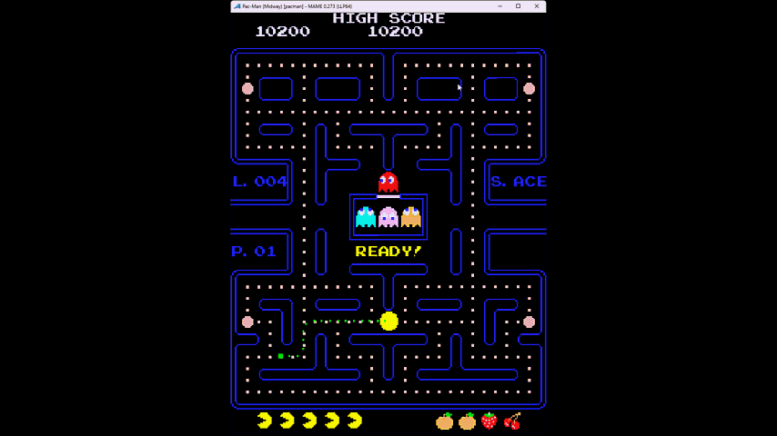

# Pattern Trainer Plugin for Pac-Man #

The Pac-Man Trainer is an aid to learning the common patterns for completing boards.  
You follow an on-screen path through each board.  For the pattern to hold,  you must
stay on track and turn the corners quickly.  



The HUD shows information which can help during gameplay.  
On the left of the screen you will see the current level (e.g. "L. 001"),  the current
pattern (e.g. "P. 1/3"), and the current status (e.g. S. ACE).  The status will change 
if you start falling behind from "ACE" to "OK" and finally "BAD" based on the number of
dropped movements/frames.  It is still possible to complete the board with a "BAD" 
status but following the now "red" path will not guarantee success and you should be 
more cautious.  
If you die then the pattern will automatically fail and you will see a blinking "FAIL" 
message.  You are on your own to complete the board.
The trainer also supports partial patterns.  For these,  you will be guided for a short
period before the path ends (or turns yellow). The HUD will display "F/S" (FREESTYLE), 
and you will be on your own to clear the remaining pellets.

Press P2 button to toggle between the currently available pattern sets.
    
### Pacstrats pattern set:
    Use only three patterns to clear boards 1 through 255 and get to the kill screen!
    Pattern 1 is used on boards 1 through 4
    Pattern 2 is used on boards 5 through 20
    Pattern 3 is used on boards 21 through 255
    All three patterns clear the entire board and get both prizes.

More information Pacstrats patterns in the video at:
	https://www.youtube.com/watch?v=wKQy8LTTzC4
	
    
### Killerclown pattern set:
    Uses 5 patterns but some of them are very similar so should be easier to learn.
    These patterns are robust until near the end of each board.  You may then need to 
    freestyle to tidy up the few remaining pellets on your own. 
    Pattern 1 is for board 1 only.  It's freestyle near the end if you prefer.
    Pattern 2 is for boards 2 through 4.  It's a slight variation from pattern 1.
    Pattern 3 if for boards 5 through 16.
    Pattern 4 is for boards 17, 19 and 20.  You may need to freestyle near the end.
    Pattern 5 is for boards 21 through 255

More information about Killerclown's patterns is to be found at:
    https://www.mameworld.info/net/pacman/patterns.html


## Minimum start up arguments:

```mame pacman -plugin pactrainer```


Tested with latest MAME version 0.256
Compatible with all MAME versions from 0.226

  
## Installing and running
 
The Plugin is installed by copying the pactrainer folder into your MAME plugins folder.

The Plugin is run by adding `-plugin pactrainer` to your MAME arguments e.g.

```mame pacman -plugin pactrainer```  

Works with "pacman" and "puckman" roms only.


## Thanks to

The MAMEdev team at
- https://docs.mamedev.org

Scott Lawrence (BleuLlama) for Pac-Man ROM Disassembly resources at
- https://github.com/BleuLlama/GameDocs/blob/master/disassemble/mspac.asm

Pacstrats for his excellent 3 pattern video at
- https://www.youtube.com/watch?v=wKQy8LTTzC4

Killerclown for his Pac-Man patterns and strategy guide at:
- https://www.mameworld.info/net/pacman/patterns.html


## Feedback

Please send feedback to jon123wilson@hotmail.com

Jon